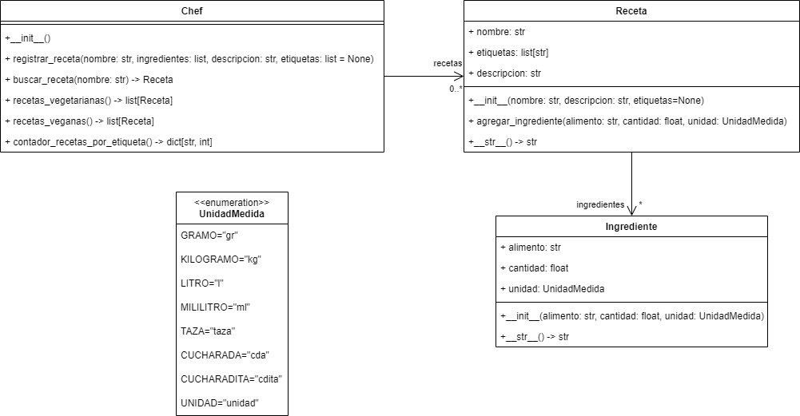

# Las Recetas del Chef

Esta es una aplicación de práctica de conceptos de programación orientada
a objetos en python, en la cual se quiere implementar un sistema de recetas
de cocina. El sistema debe permitir:

- Registrar una nueva receta
- Buscar una receta
- Listar todas las recetas vegetarianas
- Listar todas las recetas veganas
- Mostrar el número de recetas por etiqueta

El modelo del mundo del problema para dicha aplicación es el siguiente:

Implemente el modelo en el módulo `chef.py` que se encuentra en el paquete 
`recetasdelchef.model`. Para la implementación, tenga en cuenta lo que se plantea
en cada uno de los puntos del examen.

## Actividades

### 1. Implementación de clase `Ingrediente`

Implemente la clase `Ingrediente` en el módulo `chef.py` que se encuentra en el paquete
`recetasdelchef.model`. Tenga en cuenta lo siguiente:

- El constructor de la clase recibe los parámetros `alimento` de tipo **str**, `cantidad` de tipo 
**float** y `unidad` de tipo **UnidadMedida**. Con estos tres parámetros inicialice los 3 atributos 
del mismo nombre que contiene la clase (definidos en el mismo orden que se dan en el enunciado).
- La clase define un método `__str__` que retorna una representación en **string** de un ingrediente 
con el siguiente formato: `<cantidad> <unidad> de <alimento>`. Para obtener el texto de la unidad 
puede utilizar la propiedad value de la enumeración.

### 2. Implementación de clase `Receta`

Implemente la clase `Receta` en el módulo `chef.py` que se encuentra en el paquete
`recetasdelchef.model`. Tenga en cuenta lo siguiente:

- El constructor de la clase recibe los parámetros `nombre` de tipo **str**, `descripcion` de tipo 
**str** y `etiquetas` con un valor por defecto **None**. En el cuerpo del constructor, 
verifique si el parámetro `etiquetas` es **None**, en cuyo caso asígnele una lista vacía. Además, defina 
los atributos `nombre` de tipo **str** (inicialícelo con el parámetro `nombre`), `ingredientes` de tipo **lista** 
**de objetos de la clase** `Ingrediente` (inicialícelo en una lista vacía), `descripcion` de tipo **str** (inicialícelo 
con el parámetro `descripcion`) y `etiquetas` de tipo **lista de strings** (inicialícelo con el parámetro `etiquetas`). 
Defina los atributos en el mismo orden que aparecen en el enunciado.
- La clase define un método `agregar_ingrediente` que recibe los parámetros `alimento` de tipo **str**, `cantidad` de 
tipo **float** y `unidad` de tipo **UnidadMedida**. En el cuerpo del método cree un objeto de la clase `Ingrediente` y 
guárdelo en una variable llamada `ingrediente`; luego, agregue el objeto a la lista de `ingredientes` de la clase.
- La clase define un método `__str__` que retorna una representación en **string** de la receta con el siguiente formato:
> Receta `<nombre de la receta>`
> 
> Ingredientes:
>
> - `<representación en string de ingrediente 1>`
> - `<representación en string de ingrediente 2>`
> - ...
>
> Descripción:
> `<descripcion>`
 
### 3. Implementación de clase `Chef`

Implemente la clase `Chef` en el módulo `chef.py` que se encuentra en el paquete
`recetasdelchef.model`. Tenga en cuenta lo siguiente:

- La clase define un método `registrar_receta` el cual recibe los siguientes parámetros (en el mismo orden que se listan):
  - `nombre` de tipo **str**
  - `ingredientes` de tipo **lista de tuplas**, donde cada tupla contienen un **str**, un **float** y un objeto **UnidadMedida**
  - `descripcion` de tipo **str**
  - `etiquetas` de tipo **lista de strings** y con valor por defecto **None**
  
  En el cuerpo del método se llava a cabo lo siguiente:
  - Se crea un objeto de la clase `Receta` y se almacena en una variable `receta`
  - Se recorren los elementos de los `ingredientes` recibidos como parámetros y se agrega el ingrediente a la receta, 
  utilizando el método `agregar_ingrediente` de la clase `Receta`.
  - Se agrega la `receta` a la lista de recetas de la clase.

- La clase define un método `buscar_receta` que recibe como parámetro un `nombre` de tipo **str** y retorna una `Receta` o **None** 
si no la encuentra. En el cuerpo del método se lleva a cabo lo siguiente:
  - Con una variable iteradora `receta`, se recorren las `recetas` que se encuentran almacenadas en la lista de recetas de la clase.
  - Se verifica si el `nombre` dado como parámetro coincide con **alguna parte del nombre de la receta** (para evitar 
  diferencias entre mayúsculas y minúsculas se utiliza la versión en minúscula tando del parámetro como del nombre de la receta).
  - En caso de que coincida el nombre se retorna la `receta` correspondiente.
  - Si ninguna receta coincide, se retorna **None**.

- La clase define un método `recetas_vegetarianas` que retorna una lista de objetos de tipo `Receta`. En el cuerpo del 
método se lleva a cabo lo siguiente:
  - Se crea una variable `vegetarianas` y se inicializa como una **lista vacía**.
  - Con una variable iteradora `receta`, se recorre la `lista de recetas` de la clase.
  - En cada iteración se verifica si la palabra "vegetariano" hace parte de las etiquetas de la receta. 
  En caso de que si haga parte de las etiquetas, se agrega la receta a la lista `vegetarianas`.
  - Al finalizar, se retorna la lista `vegetarianas`.

- La clase define un método `recetas_veganas` que retorna una **lista de objetos de tipo Receta**. En el cuerpo del método se 
lleva a cabo lo siguiente:
  - Se crea una variable `veganas` y se inicializa como una **lista vacía**.
  - Con un variable iteradora `receta`, se recorre la lista de recetas de la clase.
  - En cada iteración se verifica si la palabra "vegano" hace parte de las `etiquetas` de la `receta`. En caso de que si 
  haga parte de las etiquetas, se agrega la receta a la lista `veganas`.
  - Al finalizar, se retorna la lista `veganas`.

- La clase define un método `contador_recetas_por_etiqueta`, el cual retorna un diccionario donde las claves son **str** y 
los valores son de tipo **int**. Cada clave representa una etiqueta y el valor correspondiente representa el número de 
recetas que tienen dicha etiqueta. En el cuerpo del método se lleva a cabo lo siguiente:
  - Se crea un diccionario vacío llamado `contador`.
  - Con una variable iteradora `receta` se recorre la lista de recetas de la clase.
  - En cada iteración, se recorre la `lista de etiquetas` de cada `receta` usando una variable iteradora `etiqueta`.
  - En cada iteración, se verifica si la `etiqueta` no hace parte de las **claves del diccionario contador**.
  - Si no hace parte de las claves, se agrega la `etiqueta` como una nueva clave y se le asigna el valor de **1**.
  - Si ya hace parte de las claves, se incrementa en **1** el valor asociado en el diccionario.
  - Al finalizar, se retorna el diccionario `contador`.